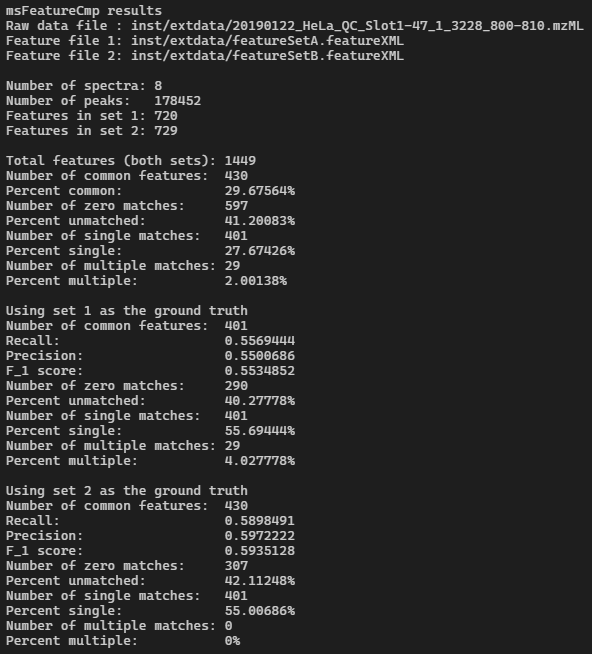

```{r, include = FALSE}
knitr::opts_chunk$set(
  collapse = TRUE,
  comment = "#>"
)
```

## Background

In proteomics, liquid chromatography-tandem mass spectrometry (LC-MS/MS) runs typically produce vast amounts of raw data that are difficult to interpret on their own. In order to make better use of such data and properly identify the proteins present in the selected samples, each peptide's precursor and fragment ion signals must be carefull found (we call these features). These features can be identified in the three-dimensional scans by their retention time (RT, measured in sec) in the liquid chromatography column, mass-to-charge (m/z, measured in Th), and signal intensity (relative and unitless) in the mass spectrometer. There are several established algorithms already, including the popular MaxQuant software suite (Max Plank Institute), as well as OpenMS (open-source), but as technology improves and new hardware is designed, it may be necessary to develop new algorithms that can better detect features. This comparator offers a method to compare different feature finding algorithms by comparing their results, and may aid developers in fine-tuning their work.

## Description

The goal of msFeatureCmp is to provide a simple and fast way to evaluate the performance of different mass spectrometry feature finding algorithms, relative to one another. This package provides a way to compare features (peptide signals) found by different algorithms, perform some basic statistical analysis on the results, and visualize the different sets of features and their locations on the raw data. Existing MS tools (like OpenMS and MaxQuant) do not provide methods that allow for cross-tool comparisons--likely because they are competitors--so this package aims to make the process more accessible.

msFeatureCmp 0.1.0 was developed with R 4.1.1 in addition to Python 3.7.9 and the Python package pyOpenMS 2.7.0 on Windows 10 19043.1348.

## Installation

Before you can use this package, you need to ensure that you have a version of Python from 3.5 to 3.7 installed, as well as the Python package `pyOpenMS` (at least version 2.4.0). Python installers can be downloaded from the Python downloads page [here](https://www.python.org/downloads/), and `pyOpenMS` can be installed from PyPI by running `pip install pyopenms` in a Python-enabled shell (e.g. bash, cmd, etc.).

You can install the development version of msFeatureCmp from [GitHub](https://github.com/ychen-uoft/msFeatureCmp) with:

``` r
install.packages("devtools")
devtools::install_github("ychen-uoft/msFeatureCmp", build_vignettes = TRUE)
library("msFeatureCmp")
```

To run the Shiny app:
``` r
runMsFeatureCmp()
```

If R has trouble finding the correct Python environment (and you have checked that all the Python prerequisites outlined above have been installed properly), then you can set it by hand with `Sys.setenv(RETICULATE_PYTHON = "<path to the correct Python binary>")` before installing the package.

## Functions

`compareFeatures(rawDataFilePath, featureFilePath1, featureFilePath2)`: the primary function for comparing feature sets and performing basic analysis. A raw mass spectrometry file, in the open-source OpenMS mzML format, is loaded, along with two feature sets, in the open-source OpenMS featureXML format. The two sets of features are compared against each other, with the function looking for groups of "similar" features (which we define to be features that are found within fixed distances of each other), calculating and assigning scores such as recall, precision, and F_1 to each set.

Using the example raw files provided in `inst/extdata`, execution may take several minutes to complete.

`getFeatureByIdx(featureFilePath, idx)`: this function is a simple interface into a featureXML file, and allows users to select a feature in the specified file and peek at its data: retention time, mass-to-charge, and signal intensity. The feature is selected by providing the function with an index, which will be used to select the requested feature at its position in the sorted feature set (by ascending RT).

`plotRawData(rawDataFilePath)`: the purpose of this function is to simply plot out a raw mass spectrometry data file (in mzML format) in a two-dimensional scatter plot (with colour to indicate intensity, the third dimension). Since raw MS data files typically have enormous amounts of information (even including the provided example files), the plot may not depict patterns in the data as accurately as possible.

`plotSingleFeatureSet(featureFilePath)`: the purpose of this function is to simply plot out a single set of found features (from a featureXML file) in a two-dimensional scatter plot (with colour to indicate intensity, the third dimension).

`plotTwoFeatureSets(featureFilePath1, featureFilePath2)`: this function "duplicates" the functionality of the previous function, plotting out two sets of found features (featureXML) in a two-dimensional scatter plot, with the second set overlaid atop the first.

`plotFeatureSetOnRawData(rawDataFilePath, featureFilePath)`: this function combines the functionality of the first two visualization functions and takes both a raw mass spectrometry data file (mzML) as well as a feature set file (featureXML), and plots both in a two-dimensional scatter plot, with the features overlaid atop the raw data. It is important to note that the features may not exactly line up with the raw data, as mass spectometers have a limited scan speed.

## Example Workflow

Included in the msFeatureCmp package are three example files, all located in inst/extdata: *20190122_HeLa_QC_Slot1-47_1_3228_800-810.mzML*, *featureSetA.featureXML*, and *featureSetB.featureXML*. The mzML file is a raw MS data file in the open-source OpenMS mzML format, and the two featureXML files are sets of features found by two different feature finders, stored in the open-source OpenMS featureXML format. For more information on how these files were obtained and processed, please see the **Contributions** section of this package's README in [GitHub](https://github.com/ychen-uoft/msFeatureCmp).

The primary comparison workflow includes only a single function: `compareFeatures` (see the prior section for more information on how it works). If we wanted to do a basic comparison and statistical analysis of these two feature sets, we would run:

``` r
compareFeatures(<path to mzML file>, <path to featureSetA>, <path to featureSetB>)
```

If using the Shiny app, the three files can first be uploaded via the "Load data" tab, and the comparison can be started by going to the "Compare" tab, selecting "Compare both feature sets", followed by the "Run" button.

The results will look like this:



The first two blocks of text give us some information about the files themselves: their provided file paths, the number of spectra and data points in the raw data, and the number of found features in each feature set. The following three blocks provide a very basic statistical analysis, including the calculation of the number of features in common between both feature sets and the number of "similar" mappings from one feature in one set to other feature(s) in the other set. We also see what happens if we choose one set of features to be a "ground truth"; i.e. using it as a reference and mapping the other set to it, which allows us to compute values such as recall, precision, and F_1 score (we are able to do this both ways because for these experiments, there is no completely "right answer" and feature finder results can only be compared relatively to one another).

If we wanted to see a visualization of these results, there are several different scatter plots that can be produced. These include the four plotting functions (with name starting with *plot*), or by going to the "Plot" tab in the Shiny app and selecting any one of the six options. For example, if we wanted to see how the locations of the features on the 2D LC-MS scan relate, we could run

``` r
plotTwoFeatureSets(<path to featureSetA>, <path to featureSetB>)
```

The results will look like this:


This above image shows the result of running the plotter via the Shiny app--if run from the terminal, only the graph underneath "Output" will be produced. Here, we have a scatter plot where the x-axis represents the retention time in the liquid chromatography column (before entering the mass spectrometer proper) in sec, and the y-axis represents mass-to-charge in the mass spectrometer in Th. The two sets of features are coloured differently in order to better determine which features (dots) come from which data set, and the label on the Right ("Type") indicates which colour belongs to which set. In this case, the red-pink dots depict the features that were loaded from the first feature set (A) and the the blue-green dots depict the features that were loaded from the second feature set (B).

## References

Chen, Y., Xu, L., & Röst, H. (2020). *Improving feature finding in LC-MS/MS runs by using additional ion mobility data*. [Unpublished BCB330Y1 final report]. Department of Cell & Systems Biology, University of Toronto, Toronto, Canada.

Meier, F., Brunner, A.-D., Frank, M., Ha, A., Bludau, I., Voytik, E., Kaspar-Schoenefeld, S., Lubeck, M., Raether, O., Bache, N., Aebersold, R., Collins, B., Röst, H., & Mann, M. (2020). diaPASEF: parallel accumulation-serial fragmentation combined with data-independent acquisition. *Nat Methods, 17*, 1229-1236. https://doi.org/10.1038/s41592-020-00998-0

Prianichnikov, N., Koch, H., Koch, S., Lubeck, M., Heilig, R., Brehmer, S., Fischer, R., & Cox, J. (2020). MaxQuant software for ion mobility enhanced shotgun proteomics. *Mol Cell Proteomics, 19*, 1058-1069. https://doi.org/10.1074/mcp.TIR119.001720

Röst, H., Schmitt, U., Aebersold, R., & Malmström, M. (2014). pyOpenMS: a Python-based interface to the OpenMS mass-spectrometry algorithm library. *Proteomics, 14(1)*, 74-77. https://doi.org/10.1002/pmic.201300246

Röst, H., Sachsenberg, T., Aiche, S., Bielow, C., Weisser, H., Aicheler, F., Andreotti, S., Ehrlich, H.-C., Gutenbrunner, P., Kenar, E., Liang, X., Nahnsen, S., Nilse, L., Pfeuffer, J., Rosenberger, G., Rurik, M., Schmitt, U., Veit, J., Walzer, M., ... Kohlbacher, O. (2016). OpenMS: a flexible open-source software platform for mass spectrometry data analysis. *Nat Methods, 13*, 741-748. https://doi.org/10.1038/nmeth.3959

Ushey, K., Allaire, J., & Tang, Y. (2021). *reticulate: interface to 'Python'*. R package version 1.22. https://CRAN.R-project.org/package=reticulate

Wickham, H. (2016). *ggplot2: elegant graphics for data analysis*. R package version 3.3.5. https://ggplot2.tidyverse.org

## Build info

``` {r}
sessionInfo()
```
